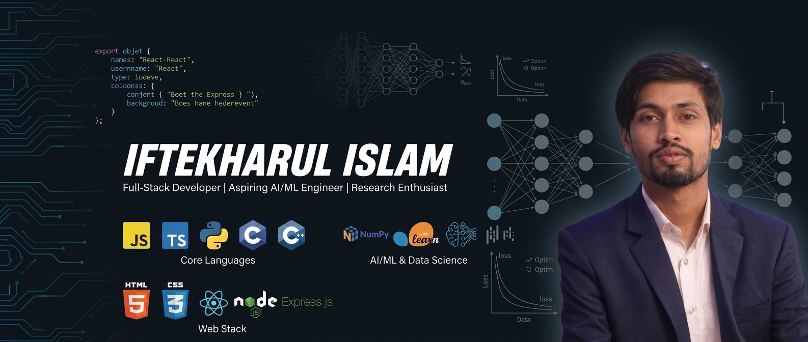

<h1 align="center">Hi 👋, I'm Iftekharul Islam</h1>
<h3 align="center">Learning Full-Stack Developer | Aspiring AI/ML Engineer | AI/ML Research Enthusiast </h3>

  

 

  

 

## 👨‍💻 About Me
- 💻 Currently learning **Full-Stack Web Development**
- 🤖 Aspiring **AI/ML Engineer**
- 🔬 Passionate about **AI/ML Research, Deep Learning & Immersive Tech**
- 🌱 Continuously learning and improving software engineering practices
- 🧠 Interested in solving real-world problems using data-driven tech
- 🚀 Building scalable web apps integrated with intelligent algorithms

 

## 📜 Certifications & Training
- 🥽 **ICT Division & Bangladesh Hi-Tech Park Authority (BDSET Project)** — Professional Training on AI for Immersive Technology *(6 Months / 288 Hours — Python, AI/ML/DL, XR/AR/VR)*
- 🤖 **Google Cloud** — Generative AI
- 🛠️ **Microsoft** — Prompt Engineering with GitHub Copilot
- 📊 **Rajshahi University HSC** — Applied Data Analysis with SPSS

 

## 🌐 Connect with me

  
  
  
  

 

# 💻 Tech Stack

### 🛠️ Programming Languages

### 🌐 Web Development

### 🧠 AI, Machine Learning & Data Science

### 🎨 Tools & Design

 

# 🎯 Current Goals & Roadmap
- [x] Building Responsive Full-Stack Web Applications
- [ ] Advanced Neural Networks & Deep Learning Implementation
- [ ] Authoring & Publishing an AI/ML Research Paper

 

# 📊 GitHub Analytics

  
  

  

 

# 🐍 Contribution Graph
<picture>
  <source media="(prefers-color-scheme: dark)" srcset="https://raw.githubusercontent.com/Iftekharul778/Iftekharul778/output/github-contribution-grid-snake-dark.svg">
  <source media="(prefers-color-scheme: light)" srcset="https://raw.githubusercontent.com/Iftekharul778/Iftekharul778/output/github-contribution-grid-snake.svg">
  
</picture>

 

## 🏆 GitHub Trophies

  

 

---

   <i>"Life is what happens when you're busy making other plans."</i> 
  — <b>John Lennon</b>

